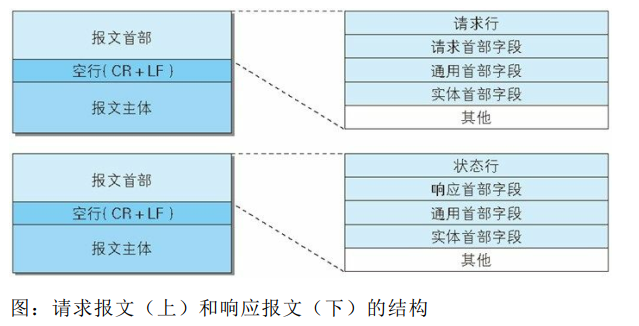
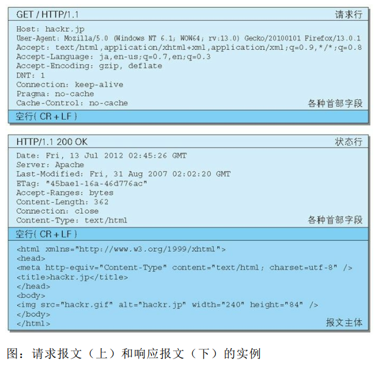
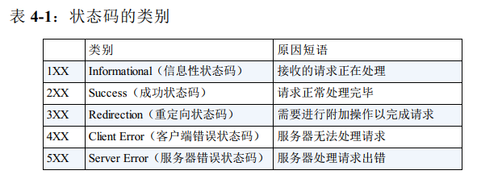
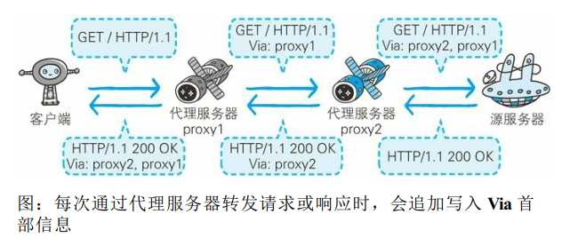
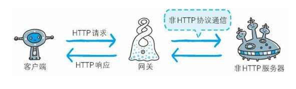
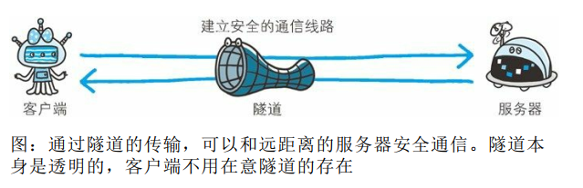
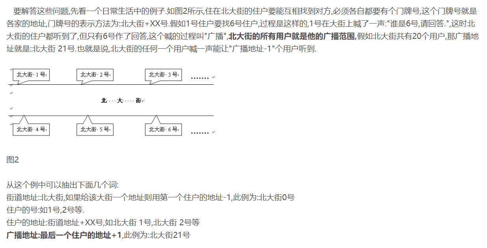

# 图解HTTP

## 了解Web及网络基础

HTTP(HyperText Transfer Protocol，超文本传输协议)：

IP协议的作用是将各种数据包传送给对方，需要两个重要的条件

- IP地址，指明节点被分配的地址
- MAC地址(Media Access Control Address)，网卡所属的固定地址

ARP协议(Address Resolution Protocol)，根据通信方的IP地址反查出对应的MAC地址

- URI(Uniform Resource Identifier)，统一资源标识符
- URL(Uniform Resource Locator)，统一资源定位符

<!-- more -->

## 简单的HTTP协议

请求报文,由请求方法、请求URI、协议版本、可选的请求首部字段和内容实体构成：

```http
GET /index.htm HTTP/1.1
-------------------------
Host: xxx.com
Connection: keep-alive
Content-Type: application/x-www-form-urlencoded
Content-Length: 16
-------------------------
name=ueno&age=31
```

响应报文，基本上由协议版本、状态码、用以解释状态码的原因短语、可选的响应首部字段及实体主体构成：

```http
HTTP/1.1 200 OK
-------------------------
Date: Tue, 1. Jul 2012 06:50:15 GMT
Content-Length: 362
Content-Type: text/html
-------------------------
<html>
...
```

HTTP/1.1是无状态协议，为了实现保持状态功能，引入Cookie技术

Cookie技术通过在请求和响应报文中写入Cookie信息来控制客户端的状态：

Cookie根据服务器端发送的响应报文内的叫做Set-Cookie的首部字段信息，通知客户端保存Cookie，当客户端下次再往服务器发送请求时，客户端会自动在请求报文中加入Cookie值后发出。服务端发现客户端的Cookie后，会检查是从哪一个客户端发送的请求，对比服务器上的记录，得到之前的状态信息

1.请求报文（没有Cookie信息的状态）

```http
GET /reader HTTP/1.1
-------------------------
Host: xxx.com
*首部字段内没有Cookie的相关信息
```

2.响应报文（服务器端生成Cookie信息）

```http
HTTP/1.1 200 OK
-------------------------
Date: Tue, 12. Jul 2012 07:12:20 GMT
Server: Apache
<Set-Cookie: sid=1544841145213486; path=/; expires=Wed,10-Oct-12 07:12:20>
Content-Type: text/plain; charset=UTF-8
```

3.请求报文（自动发送保存的Cookie信息）

```http
GET /image HTTP/1.1
-------------------------
Host: xxx.com
Cookie: sid=1544841145213486
```

## HTTP报文内的HTTP信息

HTTP报文，用于HTTP协议交互的信息称为HTTP报文，大致分为报文首部和报文主体（不一定有报文主体）

请求报文和响应报文结构：



请求报文和响应报文实例：



- 请求行，包含用于请求的方法，请求URI和HTTP版本
- 状态行，包含表明响应结果的状态码，原因短语和HTTP版本
- 首部字段，包含表示请求和响应的各种条件和属性的各类首部，一般有通用首部、请求首部、响应首部和实体首部四种
- 其他，可能包含HTTP的RFC里未定义的首部（Cookie等）

报文主体与实体主体的差异

- 报文（message），HTTP通信的基本单位，由8位组字节流组成，通过HTTP通信传输
- 实体（entity），作为请求或响应的有效载荷数据被传输，其内容由实体首部和实体主体组成

通常，报文主体等于实体主体，只有当传输中进行编码操作时，实体主体的内容发生变化，才导致实体主体和报文主体产生差异

常用的内容编码：

- gzip(GUN zip)
- compress(UNIX系统的标准压缩)
- deflate(zlib)
- identity(不进行编码)

实体主体分块发送的分块传输编码(Chunked Tranfer Coding)

MIME(Multipurpose Internet Mail Extensions，多用途因特网邮件扩展)

内容协商有服务器驱动协商、客户端驱动协商和透明协商三种类型

- Accept
- Accept-Charset
- Accept-Encoding
- Accept-Language
- Content-Language

## 返回结果的HTTP状态码



- 2XX成功
  - 200 OK
  - 204 No Content(没有资源可返回)
  - 206 Partial Content(对资源某一部分的请求)
- 3XX重定向
  - 301 Moved Permanently(永久性重定向)
  - 302 Found(临时性重定向)
  - 303 See Other()
  - 304 Not Modified
  - 307 Temporary Redirect(临时重定向)
- 4XX客户端错误
  - 400 Bad Request
  - 401 Unauthorized
  - 403 Forbidden
  - 404 Not Found
- 5XX服务器错误
  - 500 Internal Server Error
  - 503 Service Unavailable

## 与HTTP协作的Web服务器

通信数据转发程序：

- 代理

  

  代理是一种由转发功能的应用程序

  使用代理服务器的理由，利用缓存技术减少网络带宽的流量，组织内部针对特定网站的访问控制，以获取访问日志为主要目的

  分类：

  - 缓存代理，代理转发响应时，缓存代理会预先将资源的副本保存在代理服务器上
  - 透明代理，转发请求或响应时，不对报文做任何加工，反之，为非透明代理

- 网关

  

  网关是转发其他服务器通信数据的服务器

  利用网关可以由HTTP请求转化为其他协议通信

- 隧道

  

  隧道在相隔甚远的客户端和服务器两者之间进行中转，并保持双方通信连接的应用程序

  隧道的目的是确保客户端能与服务器进行安全的通信

## HTTP首部

HTTP请求报文，由方法、URI、HTTP版本、HTTP首部字段等部分构成

## IP地址、子网掩码、网关



IP地址 = 网络地址 + 主机地址

以`IP:192.168.100.1`为例:

- 网络地址（相当于街道地址）：192.168.100.0
- 主机地址（相当于门牌号）：0.0.0.1
- IP地址（相当于住户地址）：网络地址 + 主机地址 = 192.168.100.1
- 广播地址： 192.168.100.255

计算网络地址，需要子网掩码

- 情况一，可以正常通讯
  - 主机A：`IP：192.168.0.1,子网掩码：255.255.255.0`
  - 主机B：`IP：192.168.0.200,子网掩码：255.255.255.0`
- 情况二，不能通讯
  - 主机A：`IP：192.168.0.1,子网掩码：255.255.255.0`
  - 主机B：`IP：192.168.1.200,子网掩码：255.255.255.0`
- 情况三，不能通讯
  - 主机A：`IP：192.168.0.1,子网掩码：255.255.255.192`
  - 主机B：`IP：192.168.0.200,子网掩码：255.255.255.192`

计算过程，将IP地址和子网掩码都换算成二进制，然后进行与运算，结果就是网络地址

子网掩码是用于判断任意两台计算机的IP地址是否属于同一子网络的根据

网关，连接两个网络


> 参考书籍：图解HTTP
>
> 参考文章：https://blog.csdn.net/qq_36090419/article/details/80505140

